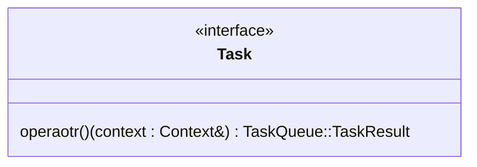

# game-logic-base
A practice project for release and distribution, providing a general library/package for a foundation for game logic.

Table of contents

---

## Task


### Outline
An Interface for signature of a task function object.

### Implementation Example
```cpp
class Task {
public:
	Task() = default;
	virtual ~Task() = default;
	virtual TaskQueue::TaskResult operator()(Context& context) = 0;
}
```

### Factors
`TaskQueue::TaskResult`

You can check it from [below](#taskqueue).

`Context`

It is undefined in this structure, follows the platform and structure you use.

---
